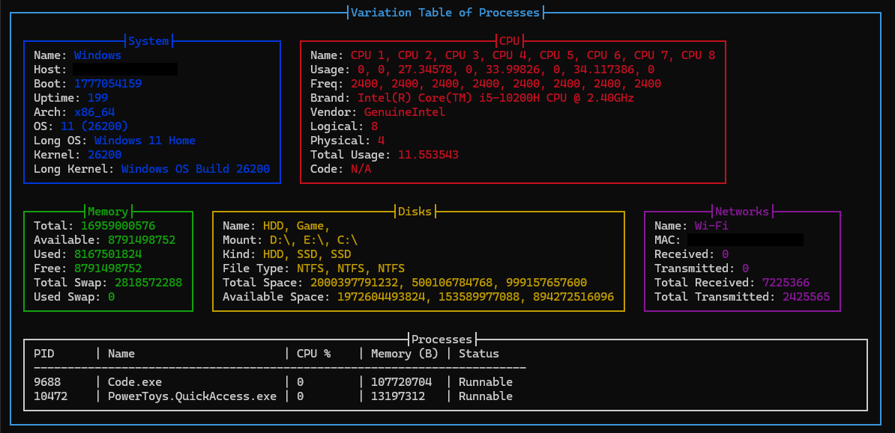
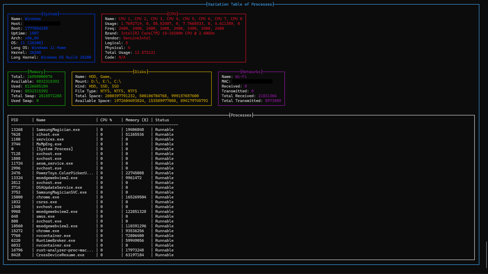

# Variaton: Table of Processes
Modern tools like `btop` and `htop` uses unix's `top` tool, which means `table of processes`. `vntop` is stands for "Variaton: Table of Processes". I used `sysinfo` crate to get bunch of cross-platform system informations. TUI library is made by me and I only used `colored` and `terminal_size` crates, that means very primative codebase. Probably I will update this program until to be fully functional. So, if you found any bug please report me in github issues or send me an e-mail.

> You can see `Roadmap` in `ROADMAP.md`.

---

## Installation and Run
> You need only rust and git tools to run.

```bash
git clone https://github.com/hanilr/vntop.git
cd vntop
cargo run
```

> You can benchmark this project with: `cargo bench`

---

## Visual
> Some of informations are sensored.

---



---

